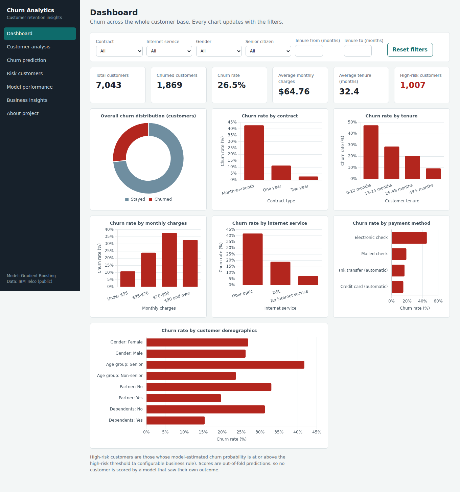
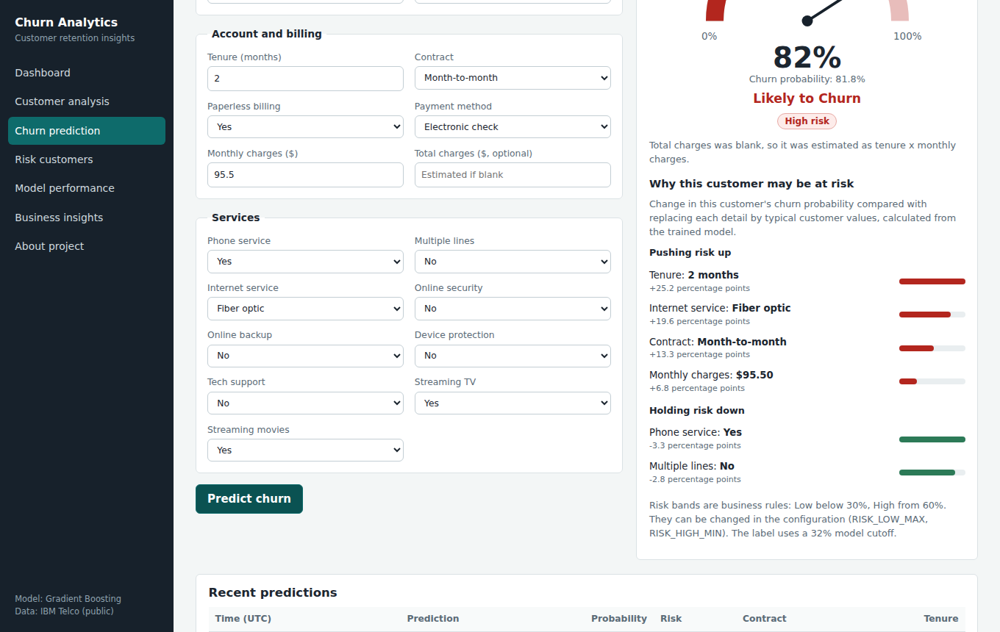
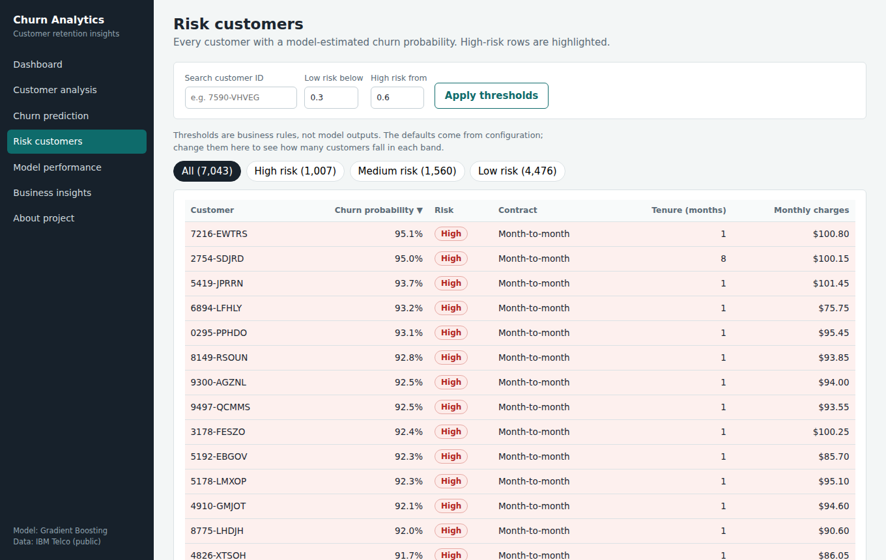
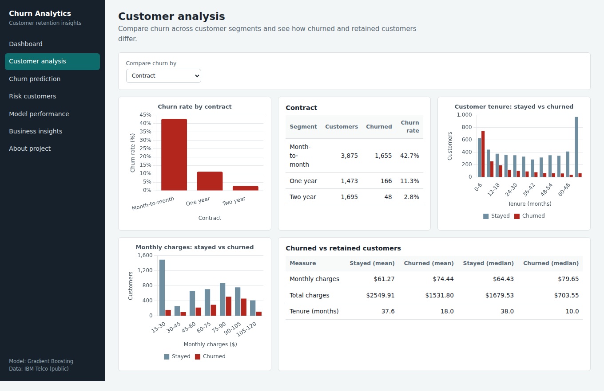
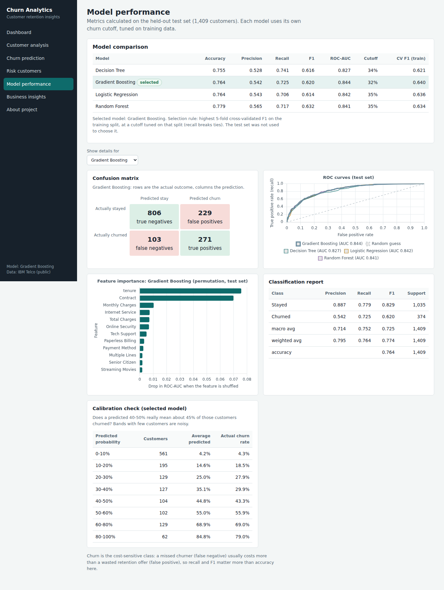
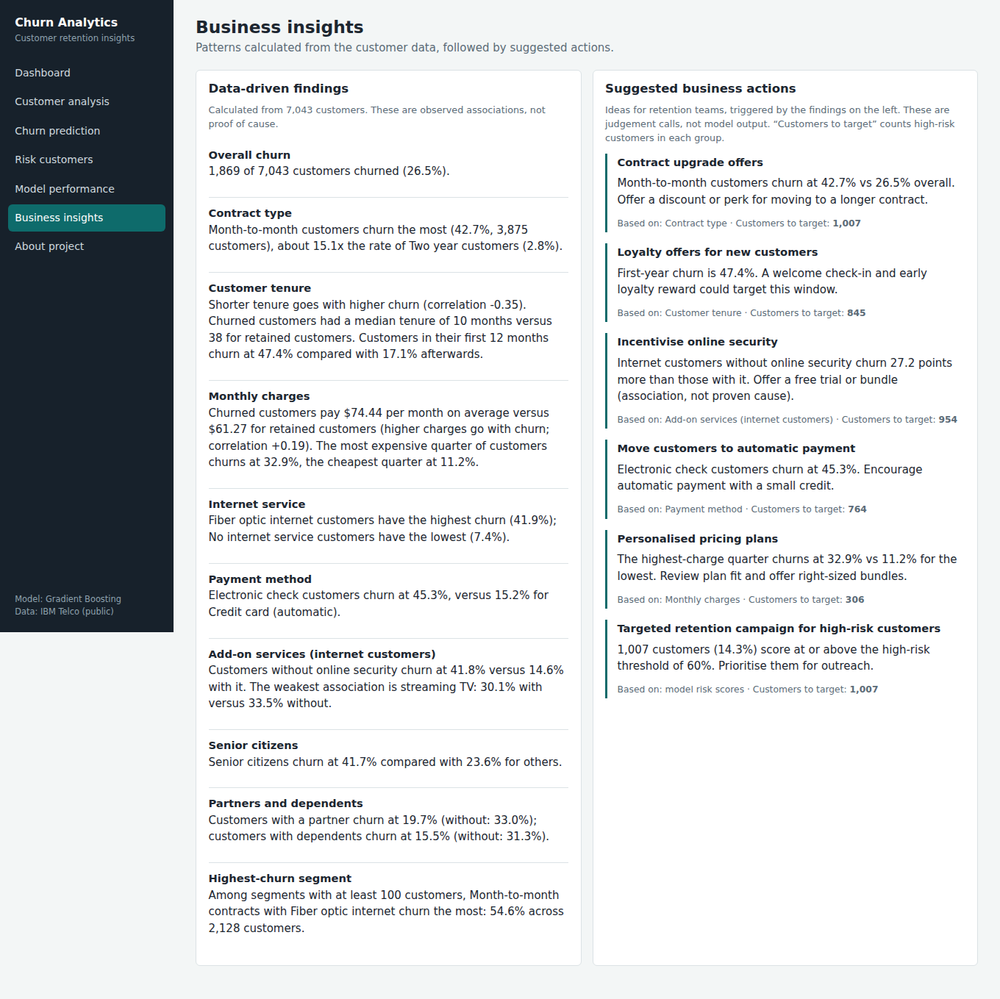
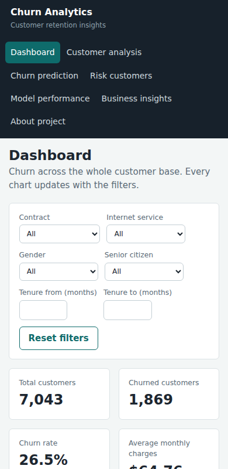

# Customer Churn Prediction and Analytics System

A data analytics and machine learning project that predicts which telecom customers are likely to leave, explains why, and gives analysts a dashboard to explore churn patterns. It covers the full path from raw data to a working web application.



## 1. Project overview

The system cleans and analyses the IBM Telco customer dataset, trains and compares four classification models, saves the best one, and serves it through a Flask web app and JSON API. Everything shown in the app (KPIs, charts, probabilities, insights, model metrics) is computed from the data and the trained model at run time. Nothing is hard-coded.

## 2. Problem statement

Winning a new customer costs far more than keeping an existing one. A retention team has a limited budget, so it needs to know **which customers are most likely to leave**, **why**, and **which groups to prioritise**.

## 3. Objectives

- Explore customer data and find the patterns that go with churn.
- Train and fairly compare several ML models, paying particular attention to recall and F1 (churn is the minority class).
- Predict churn probability for a single customer and show the factors behind it.
- Turn probabilities into business-friendly risk bands whose thresholds are configurable.
- Provide a dashboard, risk list, insights and a documented API.

## 4. Dataset

**IBM Telco Customer Churn** (public sample data): 7,043 customers, 19 feature columns plus `customerID` and the `Churn` label. Overall churn rate: **26.5%**. The CSV is included at `data/customer_churn.csv`.

If the file is ever missing, `models/data_loader.py` re-downloads it; if that fails it generates a clearly labelled **synthetic** demo dataset (`data/generate_sample_data.py`) and the app shows a banner saying so.

Data quality notes: 11 blank `TotalCharges` values, all belonging to customers with tenure 0 (not billed yet), were set to 0. No duplicate IDs, no missing labels, and no IQR outliers were found.

## 5. Technologies

| Area | Tools |
| --- | --- |
| Language | Python 3.x |
| Analytics | pandas, NumPy, Matplotlib, Seaborn |
| Machine learning | scikit-learn (Logistic Regression, Decision Tree, Random Forest, Gradient Boosting); XGBoost is trained automatically if installed |
| Backend | Flask |
| Frontend | HTML, CSS, JavaScript, Chart.js (bundled locally, no CDN needed) |
| Database | SQLite via a small `Database` class that can be re-implemented for PostgreSQL |
| Tests | pytest |

## 6. System architecture

```
 data/customer_churn.csv
          |
          v
 models/preprocessing.py  -- clean, validate, FeatureEngineer + ColumnTransformer (one sklearn Pipeline)
          |
          v
 models/train_model.py    -- split, cross-validate, tune cutoff, evaluate, select, save
          |
          v
 models/saved_model/      -- churn_model.joblib, metrics.json, metadata.json, oof_scores.csv
          |
          +--> models/predict.py      (probability, risk level, explanation)
          |
 database/database.py  <--- customers + predictions (SQLite)
          |
          v
 services/analytics.py, services/insights.py   (pandas aggregations and generated insights)
          |
          v
 app.py (Flask pages + /api/*)  -->  templates/ + static/ (dashboard, forms, charts)
```

```
project/
|-- app.py, config.py, requirements.txt, .env.example
|-- data/            customer_churn.csv, generate_sample_data.py
|-- models/          preprocessing.py, train_model.py, predict.py, data_loader.py, saved_model/
|-- services/        analytics.py, insights.py
|-- database/        database.py
|-- notebooks/       churn_analysis.ipynb  (executed EDA notebook)
|-- templates/       base, dashboard, analysis, prediction, customers, performance, insights, index (about)
|-- static/          css/, js/ (Chart.js is vendored here)
|-- tests/           pytest suite
`-- docs/screenshots/
```

## 7. ML methodology

1. **Cleaning.** Types are fixed, whitespace stripped, duplicates dropped, blank `TotalCharges` handled, the target mapped to 0/1, and `customerID` excluded from features.
2. **Feature engineering.** Two row-wise features are added inside the pipeline: `n_addon_services` (count of add-on services) and `avg_monthly_spend` (total charges / tenure). They use no information from other rows, so they cannot leak.
3. **Preprocessing.** A `ColumnTransformer` imputes (median / most frequent), scales numeric features, and one-hot encodes categoricals (unseen categories are ignored). It sits inside the same `Pipeline` as the model, so training and prediction always use identical steps.
4. **Split.** Reproducible, stratified 80/20 split (`random_state=42`): 5,634 training and 1,409 test customers. All statistics are learned from the training split only.
5. **Models.** Logistic Regression, Decision Tree, Random Forest and Gradient Boosting, trained without class re-weighting so the probabilities stay meaningful.
6. **Cutoff.** The probability above which a customer is labelled "Likely to Churn" is tuned per model to maximise F1 on out-of-fold *training* predictions. It is below 50% because churners are the minority and missing one is costly.
7. **Selection.** The model with the best 5-fold cross-validated F1 on the training split is selected (recall breaks ties). The test set is used once, to report honest metrics for every model.
8. **Explainability.** Global importance uses permutation importance on the test set. Per-customer explanations swap each feature (or group of linked features) for values from real training customers and measure how much this customer's predicted probability changes. Linked features such as internet service and its add-ons are swapped together so the "what-if" customers stay realistic. This is model-agnostic and no SHAP library is needed.

## 8. EDA findings

The full analysis, with 14 charts, is in `notebooks/churn_analysis.ipynb`. The summary below is generated by the same code the app's Insights page uses.

- **Overall churn.** 1,869 of 7,043 customers churned (26.5%).
- **Contract type.** Month-to-month customers churn the most (42.7%, 3,875 customers), about 15.1x the rate of Two year customers (2.8%).
- **Customer tenure.** Shorter tenure goes with higher churn (correlation -0.35). Churned customers had a median tenure of 10 months versus 38 for retained customers. Customers in their first 12 months churn at 47.4% compared with 17.1% afterwards.
- **Monthly charges.** Churned customers pay $74.44 per month on average versus $61.27 for retained customers (higher charges go with churn; correlation +0.19). The most expensive quarter of customers churns at 32.9%, the cheapest quarter at 11.2%.
- **Internet service.** Fiber optic internet customers have the highest churn (41.9%); No internet service customers have the lowest (7.4%).
- **Payment method.** Electronic check customers churn at 45.3%, versus 15.2% for Credit card (automatic).
- **Add-on services (internet customers).** Customers without online security churn at 41.8% versus 14.6% with it. The weakest association is streaming TV: 30.1% with versus 33.5% without.
- **Senior citizens.** Senior citizens churn at 41.7% compared with 23.6% for others.
- **Partners and dependents.** Customers with a partner churn at 19.7% (without: 33.0%); customers with dependents churn at 15.5% (without: 31.3%).
- **Highest-churn segment.** Among segments with at least 100 customers, Month-to-month contracts with Fiber optic internet churn the most: 54.6% across 2,128 customers.

## 9. Model comparison

All metrics are measured on the held-out test set (1,409 customers).

| Model | Accuracy | Precision | Recall | F1 | ROC-AUC | Cutoff |
| --- | ---: | ---: | ---: | ---: | ---: | ---: |
| Logistic Regression | 0.764 | 0.543 | 0.706 | 0.614 | 0.842 | 35% |
| Decision Tree | 0.755 | 0.528 | 0.741 | 0.616 | 0.827 | 34% |
| Random Forest | 0.779 | 0.565 | 0.717 | 0.632 | 0.841 | 35% |
| **Gradient Boosting** (selected) | 0.764 | 0.542 | 0.725 | 0.620 | 0.844 | 32% |

**Selected: Gradient Boosting.** It had the best cross-validated F1 on the training split. The four models are close: Random Forest has the highest test F1 and accuracy, so the choice is not a landslide. Differences of this size are within what you would expect from a different random split, so the app is not claiming one model is decisively better.

Selected model confusion matrix: 271 true positives, 103 false negatives (missed churners), 229 false positives, 806 true negatives.

Top features by permutation importance: tenure (0.076), Contract (0.070), MonthlyCharges (0.010), InternetService (0.007), TotalCharges (0.007).

**Calibration.** Because the model is not class re-weighted, "40-50%" really means about 45% of such customers churned:

| Predicted probability | Customers (test) | Average predicted | Actual churn rate |
| --- | ---: | ---: | ---: |
| 0-10% | 561 | 4.2% | 4.3% |
| 10-20% | 195 | 14.6% | 18.5% |
| 20-30% | 129 | 25.0% | 27.9% |
| 30-40% | 127 | 35.1% | 29.9% |
| 40-50% | 104 | 44.8% | 43.3% |
| 50-60% | 102 | 55.0% | 55.9% |
| 60-80% | 129 | 68.9% | 69.0% |
| 80-100% | 62 | 84.8% | 79.0% |

## 10. Application screenshots

| | |
| --- | --- |
|  |  |
|  |  |
|  |  |

## 11. Installation

Requires Python 3.10 or newer.

```bash
cd project
python -m venv .venv
source .venv/bin/activate          # Windows: .venv\Scripts\activate
pip install -r requirements.txt
```

## 12. How to run

```bash
python app.py                      # then open http://127.0.0.1:5000
```

A trained model and the dataset are included, so the app starts immediately. The SQLite database is created and filled automatically on first run (and refilled if the model is retrained).

```bash
python -m models.train_model       # retrain, compare and save a new model (about a minute)
python -m pytest                   # run the test suite
jupyter notebook notebooks/churn_analysis.ipynb
```

### Configuration (environment variables)

| Variable | Default | Meaning |
| --- | --- | --- |
| `SECRET_KEY` | `dev-only-change-me` | Flask secret. Set a real value outside local use. |
| `DATABASE_URL` | `sqlite:///database/churn.db` | Database location. Only SQLite is implemented. |
| `RISK_LOW_MAX` | `0.30` | Probability below this is **Low** risk. |
| `RISK_HIGH_MIN` | `0.60` | Probability at or above this is **High** risk; in between is **Medium**. |
| `FLASK_DEBUG` | `0` | Set `1` for debug mode. |

The risk bands are **business rules, not model outputs**. Change them to match the size of your retention budget. The Risk Customers page also lets you try other thresholds without restarting.

## 13. API documentation

All endpoints return JSON. Errors look like `{"error": "message"}`, plus `"details"` with per-field messages for invalid prediction input (HTTP 400).

| Method and path | Purpose |
| --- | --- |
| `GET /health` | Liveness check. |
| `GET /api/meta` | Allowed category values, thresholds, model and dataset info. |
| `GET /api/dashboard` | KPIs and chart data. Filters: `contract`, `internet`, `gender`, `senior` (0/1), `tenure_min`, `tenure_max`. Optional `high_min`. |
| `GET /api/analysis?by=Contract` | Churn by any segment, plus tenure and charge histograms. Same filters. |
| `GET /api/customers` | Customers with probability and risk. Params: `search` (ID), `risk` (Low/Medium/High), `sort`, `order`, `page`, `per_page`, `low_max`, `high_min`. |
| `POST /api/predict` | Predict churn for one customer (below). Saves the result to SQLite. |
| `GET /api/predictions` | The 10 most recent saved predictions. |
| `GET /api/model-performance` | Metrics for every model, confusion matrices, ROC points, feature importance, calibration. |
| `GET /api/insights` | Generated findings and suggested actions. |

Example:

```bash
curl -X POST http://127.0.0.1:5000/api/predict -H "Content-Type: application/json" -d '{
  "gender": "Female", "SeniorCitizen": 0, "Partner": "No", "Dependents": "No", "tenure": 2,
  "PhoneService": "Yes", "MultipleLines": "No", "InternetService": "Fiber optic",
  "OnlineSecurity": "No", "OnlineBackup": "No", "DeviceProtection": "No", "TechSupport": "No",
  "StreamingTV": "Yes", "StreamingMovies": "Yes", "Contract": "Month-to-month",
  "PaperlessBilling": "Yes", "PaymentMethod": "Electronic check",
  "MonthlyCharges": 95.5, "TotalCharges": ""
}'
```

Response (shortened):

```json
{
  "prediction": "Likely to Churn", "churn": true, "probability": 0.82, "risk_level": "High",
  "thresholds": {"low_max": 0.3, "high_min": 0.6, "decision": 0.32},
  "factors": {
    "increase_risk": [{"feature": "tenure", "label": "Tenure", "value": "2 months", "impact_points": 25.2}],
    "reduce_risk": [{"feature": "PhoneService", "label": "Phone service", "value": "Yes", "impact_points": -3.3}]
  },
  "notes": ["Total charges was blank, so it was estimated as tenure x monthly charges."]
}
```

`impact_points` is the change in this customer's churn probability, in percentage points, compared with swapping that detail for typical customer values. A blank `TotalCharges` is estimated as tenure x monthly charges and the response says so. `SeniorCitizen` accepts 0/1/Yes/No. Add-on services are set to "No internet service" automatically when `InternetService` is "No".

## 14. Results

- The best models reach ROC-AUC of about 0.84 and recall of 0.71 to 0.74 at F1 of about 0.62 to 0.63. These are in line with commonly reported results on this dataset, which has limited predictive signal.
- Contract type, tenure, internet service, payment method and support services are the strongest drivers of churn in both the EDA and the model.
- Probabilities are well calibrated, so they can be used directly for prioritisation and expected-value reasoning.
- Customer risk scores shown in the app are **out-of-fold** predictions (each customer is scored by a model that never saw them), so the risk list is not inflated by memorisation.

## 15. Limitations

- Single snapshot, no dates. The model cannot learn trends or seasonality, and cannot tell when a customer will leave.
- Explanations show associations learned by the model, not proven causes. A tech-support offer might not reduce churn even though customers with tech support churn less.
- The suggested business actions are rule-based ideas triggered by thresholds in the data, not experiment-tested.
- Models use sensible fixed hyperparameters with no extensive tuning, and the four models perform similarly.
- Per-customer explanations treat features one at a time (with linked groups), so strongly interacting features can be under- or over-credited.
- The app has no login or user accounts, so it is meant for local or internal use. Add authentication before exposing it.
- Predictions are stored with the entered features but no names or contact details.

## 16. Future improvements

XGBoost or LightGBM comparison, SHAP explanations, real-time prediction from a live data feed, cloud deployment, Docker packaging, PostgreSQL support, automated retraining and drift checks, customer segmentation, real-time monitoring, and A/B testing of retention strategies to measure which actions really reduce churn.

## 17. Tests

`python -m pytest` runs 2 test modules covering preprocessing and validation, model loading, probability generation, the prediction endpoint, invalid input handling, dashboard/customer endpoints and database operations.
